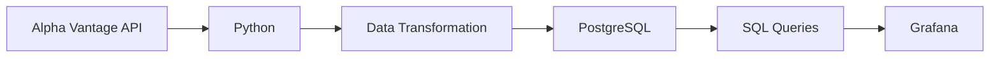

# Real-Time-Daily-Stock-Pipeline
## Project Overview
This project implements a daily stock data ETL pipeline that extracts stock market data using Python, transforms the data for analysis, loads the processed datasets into PostgreSQL, and uses Grafana to monitor stock performance over time. The pipeline works with daily stock data for selected companies and produces analytical metrics such as 7-day moving averages, 20-day moving averages, percentage price changes, and portfolio values.  The project demonstrates how raw financial market data can be transformed into structured, analysis-ready data and connected to a monitoring dashboard.
## Problem Statement

Stock market data is generated continuously and can be difficult to monitor efficiently when working directly with raw API responses.

This project was built to create a structured workflow for:

- Extracting daily stock market data
- Cleaning and transforming the raw data
- Calculating useful stock performance metrics
- Storing the processed data in PostgreSQL
- Monitoring stock performance through Grafana

## Pipeline Architecture


## Architecture Components
| Component |	Tool |
| :--- | :--- |
| Data source	| Alpha Vantage API |
| Data extraction	| Python |
| Data transformation |	Python / Pandas |
| Data storage	| PostgreSQL |
| Data querying	| SQL |
| Monitoring / Visualization | Grafana |

## Tech Stack
Python

Pandas

Requests

PostgreSQL

SQL

Grafana

Git

GitHub

## Data Source

The stock data is retrieved from the Alpha Vantage API using the TIME_SERIES_DAILY endpoint.

### The pipeline works with the following stock symbols:

AAPL

GOOGL

MSFT

NFLX

TSLA

### The extracted data contains:

Symbol

Date

Open price

High price

Low price

Closing price

## Pipeline Walkthrough
### 1. Extraction

Python sends requests to the Alpha Vantage API to retrieve daily stock market data.

The extracted responses are stored and processed in Python.

### 2. Transformation

The raw API response is converted into a structured Pandas DataFrame.

The data is then:

Converted to appropriate data types

Checked for missing values

Checked for duplicate records

Sorted by stock symbol and date

Prepared for analytical calculations

### 3. Stock Metrics

The pipeline calculates:

7-Day Moving Average

A rolling average of closing prices over seven trading days.

20-Day Moving Average

A rolling average of closing prices over twenty trading days.

Percentage Change

The percentage change in closing price between consecutive observations for each stock.

### 4. Portfolio Calculation

The pipeline also calculates daily portfolio values by grouping stock holding values by date.

### 5. PostgreSQL

The transformed datasets are loaded into PostgreSQL.

The database contains separate tables for stock prices, calculated metrics, and portfolio values.

### 6. SQL Analysis

SQL queries are used to combine and analyze the stored datasets.

The final analytical dataset combines stock information with calculated metrics and portfolio values.

### 7. Grafana Monitoring
Grafana connects to PostgreSQL and uses SQL queries to visualize the processed stock data.

The dashboard is used to monitor stock performance and observe how the metrics change over time.

## Database Schema
### stocks

```text
stocks
├── id
├── symbol
├── date
├── open
├── high
├── low
└── close

### metrics
metrics
├── id
├── symbol
├── date
├── moving_average_7
├── moving_average_20
└── pct_change

### portfolio
portfolio
├── id
├── date
└── portfolio_total
```

Key SQL Analysis

The project uses SQL to combine stock prices, calculated metrics, and portfolio values into an analysis-ready dataset.

It also queries the latest available metrics to identify percentage price changes across the tracked stocks.

### Project Structure
```text
real-time-daily-stock-pipeline/
├── Stock ETL Pipeline (1).ipynb
├── Daily_Stock ETL Pipeline.sql
├── .gitignore
└── README.md
```

## How to Run
### 1. Clone the repository
```
</> bash
git clone <your-repository-url>
cd real-time-daily-stock-pipeline
```

### 2. Install dependencies

pip install pandas requests

### 3. Configure your Alpha Vantage API key

Store your API key as an environment variable:

ALPHAVANTAGE_API_KEY=your_api_key

Do not commit your API key to GitHub.

### 4. Run the Python notebook

Open:

Stock ETL Pipeline (1).ipynb

Run the extraction and transformation steps.

### 5. Set up PostgreSQL

Create the required PostgreSQL tables using:

Daily_Stock ETL Pipeline.sql

### 6. Connect Grafana

Connect Grafana to the PostgreSQL database and use SQL queries to build the monitoring visualizations.

## Key Concepts Demonstrated
API data extraction
Data transformation with Pandas
Data type handling
Duplicate and missing-value checks
Rolling averages
Percentage change calculations
Portfolio aggregation
PostgreSQL data storage
SQL data analysis
Grafana monitoring
Git/GitHub version control
Future Improvements
Automate the daily extraction process
Introduce scheduled execution
Move API credentials completely into environment variables
Add automated data quality checks
Add Grafana alerts for significant price movements
Improve pipeline error handling
Automate the PostgreSQL loading process

### Recommended GitHub structure

I'd make the repository:

```text
real-time-daily-stock-pipeline/
│
├── README.md
├── Stock ETL Pipeline (1).ipynb
├── Daily_Stock ETL Pipeline.sql
└── .gitignore


